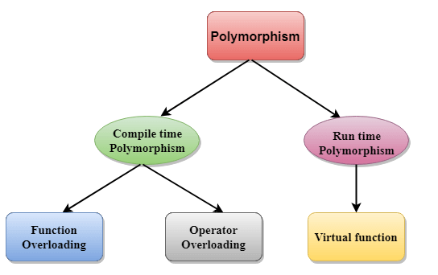

# Polymophism
# C++ Polymorphism
>The term "Polymorphism" is the combination of "poly" + "morphs" which means many forms. It is a greek word. In object-oriented programming, we use 3 main concepts: inheritance, encapsulation, and polymorphism.

# Real Life Example Of Polymorphism
>Let's consider a real-life example of polymorphism. A lady behaves like a teacher in a classroom, mother or daughter in a home and customer in a market. Here, a single person is behaving differently according to the situations.

- There are two types of polymorphism in C++:
1. Compile time.
2. run time.
